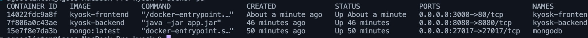
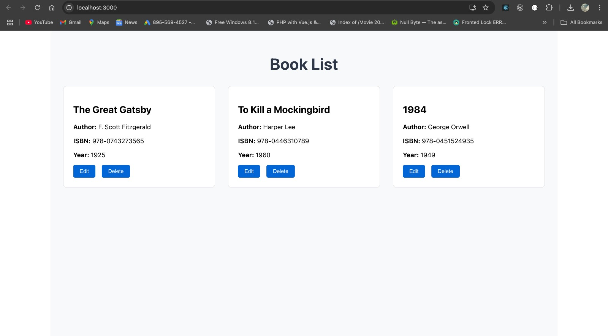
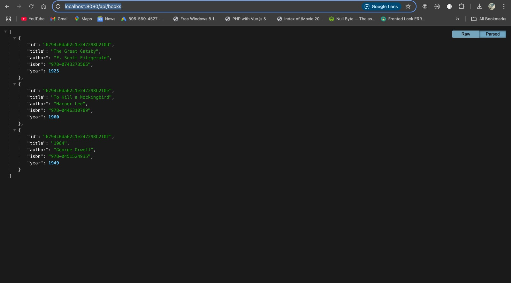
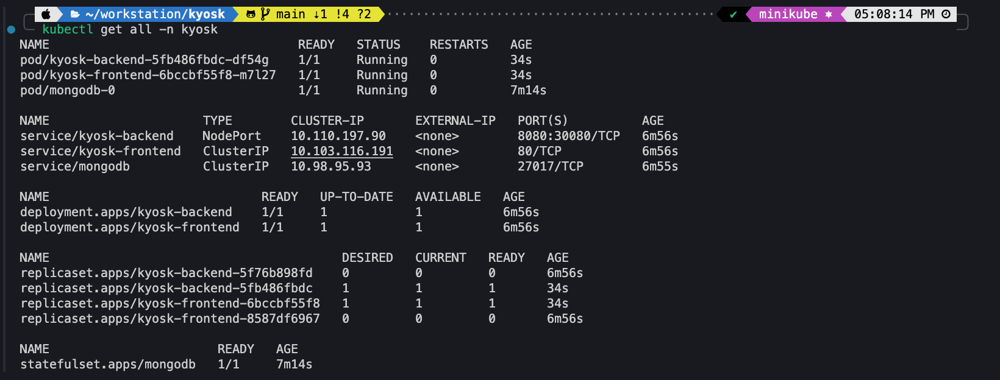
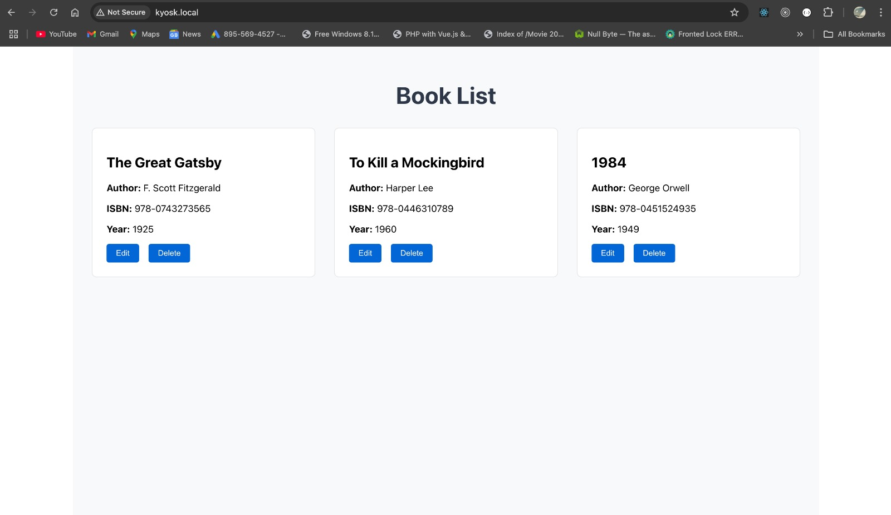
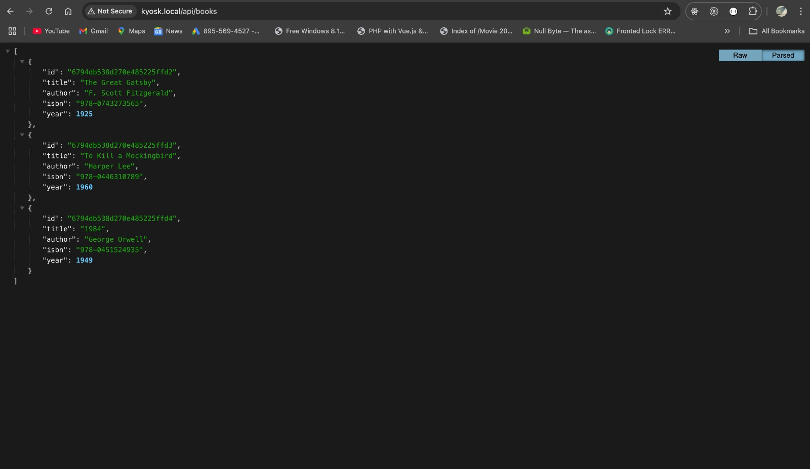

# Full-Stack Application with Kubernetes Deployment

This project demonstrates a containerized full-stack application deployment using Spring Boot, React, and MongoDB, with CI/CD automation through GitHub Actions and deployment on Minikube.

## Project Structure

```
├── backend/          # Spring Boot REST API
├── frontend/         # React frontend application
├── k8s/              # Kubernetes manifests
└── .github/workflows # GitHub Actions CI/CD pipeline
```

## Components

1. Backend (Spring Boot)
   - REST API with /health and /books endpoints
   - MongoDB integration
   - Containerized with Docker
   - Health monitoring endpoints /actuator/health

2. Frontend (React)
   - Responsive book list display
   - Real-time integration with backend API
   - Containerized with Nginx for production

3. Database
   - MongoDB for data persistence
   - Configurable authentication
   - Volume persistence in Kubernetes

## Local Development Setup

### Prerequisites

- Java 17+
- Node.js 16+
- Docker
- Minikube
- kubectl

### One Click Deployments
#### 1. Docker
```bash
chmod +x ./deploy-local.sh
./deploy-local.sh
```

#### 2. Minikube(Tested on MacOs Only)
Should work on LInux as well.
```bash
chmod +x ./deploy-minikube.sh
./deploy-minikube.sh
```

### Step by Step Deployments 
#### 1. Docker
1. Create a Docker network:
```bash
docker network create kyosk-network
```

2. Run MongoDB:
```bash
docker run -d --name mongodb \
  --network kyosk-network \
  -p 27017:27017 \
  -e MONGO_INITDB_ROOT_USERNAME=admin \
  -e MONGO_INITDB_ROOT_PASSWORD=password123 \
  mongo:latest
```

3. Build and run the backend:
```bash
cd backend
docker build -t kyosk-backend .
docker run -d --name kyosk-backend \
  --network kyosk-network \
  -p 8080:8080 \
  kyosk-backend
```

4. Build and run the frontend:
```bash
# The REACT_APP_API_URL build tag is used for local docker deployments only
cd frontend
docker build -t kyosk-frontend --build-arg REACT_APP_API_URL=http://localhost:8080 .
docker run -d --name kyosk-frontend -p 3000:80 kyosk-frontend
```

### Verifying the Setup

1. Check container status:
```bash
docker ps
```


2. View container logs:
```bash
docker logs kyosk-backend
docker logs kyosk-frontend
```

3. Access the applications:
- Frontend: http://localhost:3000


- Backend API: http://localhost:8080/api/books



### K8s - Minikube

1. Start Minikube with sufficient resources:
```bash
minikube start --cpus 2 --memory 4096
```

2. Enable and verify required addons:
```bash
# Enable Ingress addon
minikube addons enable ingress

# Verify Ingress controller is running
kubectl get pods -n ingress-nginx


### Deployment Steps

1. Create namespace:
```bash
kubectl create namespace kyosk
```

2. Create ConfigMap and Secrets:
```bash
# This can be adjusted accordingly, defaults exists. includes db credentials etc.
kubectl apply -f k8s/configmap.yaml -n kyosk
kubectl apply -f k8s/secret.yaml -n kyosk
```

3. Deploy MongoDB:
```bash
kubectl apply -f k8s/mongodb.yaml -n kyosk
```

1. Deploy application components, services/ingress:
```bash
kubectl apply -f k8s/deployment.yaml -n kyosk
kubectl apply -f k8s/ingress.yaml -n kyosk
kubectl apply -f k8s/service.yaml -n kyosk
```

2. Verify deployment:
```bash
kubectl get all -n kyosk
```



3. Access the application:
```bash
# Get Minikube IP address
minikube ip

# Add the following entry to your /etc/hosts file (requires sudo) to pint to the nginx ingress


echo "127.0.0.1 kyosk.local" | sudo tee -a /etc/hosts


# For macOS users using Docker driver
# Run minikube tunnel with sudo (required for Ingress to work)
sudo minikube tunnel

# Access the application using the domain
http://kyosk.local
```





Note: The hosts file location varies by operating system:
- Linux/macOS: `/etc/hosts`
- Windows: `C:\Windows\System32\drivers\etc\hosts`

## CI/CD Pipeline

The GitHub Actions workflow (`ci-cd.yaml`) automates the following steps:

1. Build and Test
   - Runs unit tests for backend and frontend


2. Build and Push Images
   - Builds Docker images for both services
   - Tags images with Git SHA and latest
   - Pushes to GitHub Container Registry

3. Deploy to Kubernetes
   - Updates deployment manifests
   

### Environment Variables

Required GitHub Secrets:
- `GHCR_TOKEN`: GitHub Container Registry access token(Optional, for pushing to repo)
- `KUBE_CONFIG`: Base64 encoded kubeconfig file(auto-generated by minikube)

## Development Decisions

1. **Architecture**:
   - Microservices architecture for independent scaling
   - Containerization for consistent environments

2. **Technology Stack**:
   - Spring Boot: Robust backend framework
   - React: Modern frontend development
   - MongoDB: Flexible document database
   - Nginx: Production-grade web server

3. **Container Registry**:
   - GitHub Container Registry for tight integration
   - Automated image tagging and versioning

## Troubleshooting

1. **Container Issues**:
   - Check logs: `docker logs <container-name>`
   - Verify network: `docker network inspect kyosk-network`
   - Restart container: `docker restart <container-name>`

2. **Kubernetes Issues**:
   - Check pod status: `kubectl describe pod <pod-name> -n kyosk`
   - View logs: `kubectl logs <pod-name> -n kyosk`
   - Restart deployment: `kubectl rollout restart deployment <deployment-name> -n kyosk`

3. **Application Issues**:
   - Backend health: `curl http://localhost:8080/actuator/health` 
   - MongoDB connection: Check backend logs for connection errors
   - Frontend API: Check browser console for API errors